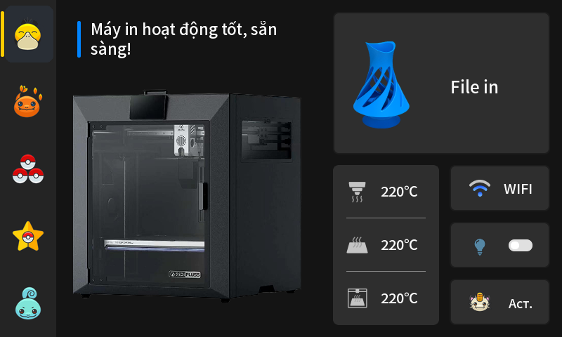
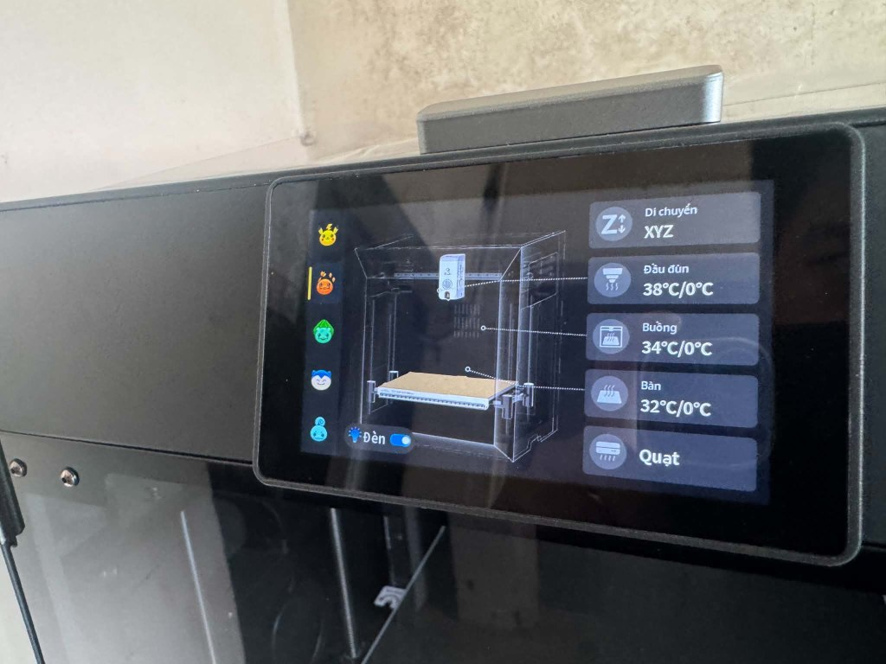
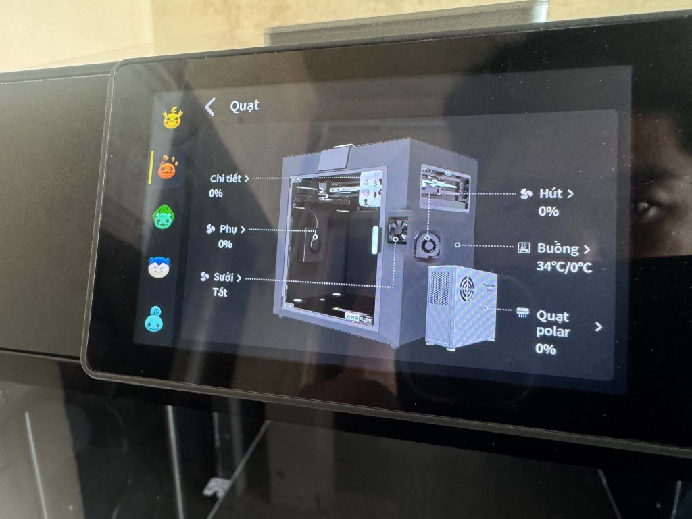
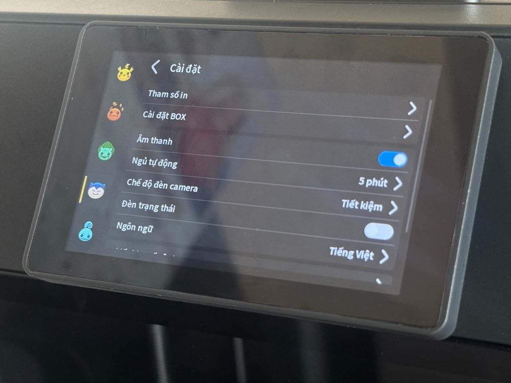

# ⚡ QIDI Plus 5 - Pokemon Custom UI Theme

<div align="center">

<a href="https://hawklabs.vn">
  
</a>

<p><strong>HA.WK LABS</strong> • <em>Hardware & Adaptive Works</em></p>

[](https://github.com/Klipper3d/klipper)
[](LICENSE)
[-orange.svg)](https://qidi3d.com)
[](https://github.com/tonngodoc/qidi-plus5-pokemon-theme)

**[🇬🇧 English](#-english) | [🇻🇳 Tiếng Việt](#-tiếng-việt)**

<br>



</div>

---

### 📸 Live Photos on Physical Printer / Hình ảnh thực tế trên máy in

<div align="center">

| Control Tab (Charmander) | Fans & Cooling Menu |
| :---: | :---: |
|  |  |

| Settings Sub-menu | System & Account (Pokeball) |
| :---: | :---: |
|  |  |

</div>

---

## 🇬🇧 ENGLISH

Transform your **QIDI Plus 5** touch screen with a playful, high-resolution **Pokémon Custom UI Theme**. Every core navigation tab, avatar, and system menu icon has been crafted and converted to native LVGL format (`.bin` + `.png`) for instant loading with zero lag.

### 🌟 Features & Included Icons

- **5 Starter Navigation Tabs (4 States each: Normal, Checked, Pressed, Checked Pressed):**
  - 🏠 **Home:** Psyduck (Vịt Koduck)
  - 🎮 **Control:** Charmander
  - 🧵 **Filament:** 3 Pokéballs
  - ⚙️ **Setting:** PokéStar
  - 💬 **Message:** Squirtle
- **Account & System Icons:**
  - ⚡ **Account Avatar:** Pikachu (`144x144` px avatar on Settings screen)
  - 🐱 **AI Assistant:** Meowth (on Home, Printing, and Message screens)
  - 📍 **Network:** PokéStop WiFi
  - 📱 **Function:** Pokédex Phone
  - 📦 **Storage:** Pokémon Storage Box
  - 🚀 **Firmware:** Upgrade Rocket
  - ⚙️ **Settings:** PokéStar Core Icon

---

### 🚀 1-Click Fast Install (Recommended)

1. Connect to your printer via SSH:
   ```bash
   ssh qidi@<PRINTER_IP>
   # Default password: qiditech
   ```
2. Copy and paste this single command and press **Enter**:
   ```bash
   curl -sSL https://raw.githubusercontent.com/tonngodoc/qidi-plus5-pokemon-theme/main/install.sh | bash
   ```
*(The script automatically creates a backup of your original factory icons and restarts the UI service in 3 seconds).*

---

### 📦 Manual Offline Install

1. Download [`qidi_plus5_pokemon_theme.zip`](qidi_plus5_pokemon_theme.zip) and extract it.
2. Use **WinSCP** or **FileZilla** (SFTP port 22, user `qidi`, password `qiditech`) to copy the extracted folder to `/home/qidi/`.
3. Run the installer via SSH:
   ```bash
   cd /home/qidi/qidi-plus5-pokemon-theme
   bash install.sh
   ```

---

### 🔄 Uninstallation (Restore Factory Icons)

To restore original factory icons at any time, run:

```bash
bash /home/qidi/uninstall_pokemon_theme.sh
```

---

## 🇻🇳 TIẾNG VIỆT

Gói nâng cấp toàn diện giao diện màn hình cảm ứng máy in 3D **QIDI Plus 5** thành chủ đề **Pokémon** siêu dễ thương và sắc nét. Tất cả biểu tượng được tối ưu chuẩn định dạng LVGL nội tại của QIDI Client, đảm bảo chuyển trang mượt mà, phản hồi cảm ứng nhạy bén và không gây giật lag Klipper.

### 🌟 Danh sách biểu tượng Pokémon trong gói

- **5 Tab điều hướng Sidebar (Đầy đủ 4 trạng thái cảm ứng):**
  - 🏠 **Trang chủ (Home):** Vịt Psyduck (Koduck)
  - 🎮 **Điều khiển (Control):** Khủng long lửa Charmander
  - 🧵 **Sợi nhựa (Filament):** 3 Quả cầu Pokéball
  - ⚙️ **Cài đặt (Setting):** Ngôi sao PokéStar
  - 💬 **Tin nhắn (Message):** Rùa Squirtle
- **Biểu tượng trang cài đặt & Trợ lý AI:**
  - ⚡ **Ảnh đại diện Tài khoản:** Pikachu (`144x144` px trên trang Cài đặt)
  - 🐱 **Trợ lý AI:** Mèo Meowth (biểu tượng Trợ lý AI trên Trang chủ, Trang in và Màn hình Tin nhắn AI)
  - 📍 **Mạng WiFi:** Điểm dừng chân PokéStop
  - 📱 **Chức năng:** Điện thoại Pokédex
  - 📦 **Bộ nhớ USB:** Hộp lưu trữ Pokémon
  - 🚀 **Firmware:** Tên lửa thăng cấp
  - ⚙️ **Hệ thống:** Biểu tượng ngôi sao PokéStar

---

### 🚀 Cách 1: Cài đặt 1 chạm qua SSH (Khuyên dùng)

1. Mở Terminal / PowerShell / PuTTY kết nối SSH vào máy in:
   ```bash
   ssh qidi@<IP_MÁY_IN>
   # Mật khẩu mặc định: qiditech
   ```
2. Dán duy nhất dòng lệnh sau và nhấn **Enter**:
   ```bash
   curl -sSL https://raw.githubusercontent.com/tonngodoc/qidi-plus5-pokemon-theme/main/install.sh | bash
   ```
*(Script sẽ tự động sao lưu toàn bộ icon gốc của nhà sản xuất vào thư mục an toàn và khởi động lại màn hình trong 3 giây).*

---

### 📦 Cách 2: Cài đặt thủ công (Không cần Internet)

1. Tải file [`qidi_plus5_pokemon_theme.zip`](qidi_plus5_pokemon_theme.zip) về máy tính và giải nén.
2. Dùng **WinSCP** hoặc **FileZilla** chép thư mục vào `/home/qidi/`.
3. Chạy lệnh cài đặt qua SSH:
   ```bash
   cd /home/qidi/qidi-plus5-pokemon-theme
   bash install.sh
   ```

---

### 🔄 Cách khôi phục lại biểu tượng xuất xưởng ban đầu

Nếu muốn quay trở lại biểu tượng gốc mặc định của QIDI bất kỳ lúc nào, chỉ cần chạy:

```bash
bash /home/qidi/uninstall_pokemon_theme.sh
```

---

## 📜 Credits & License / Bản quyền biểu tượng

- **Icon Pack Source**: Pokémon Go icons pack by [Roundicons Freebies](https://www.flaticon.com/packs/pokemon-go) on [Flaticon](https://www.flaticon.com/).
- **Pokémon Intellectual Property**: All Pokémon characters and imagery are trademarks and copyright of **Nintendo**, **Creatures Inc.**, and **GAME FREAK inc.** This project is a non-commercial, fan-made UI customization designed for the 3D printing community.
- **Theme Package & Scripts**: Licensed under the [MIT License](LICENSE).
- **Author & Maintainer**: **TÔN NGỘ ĐỘC** ([HA.WK LABS](https://hawklabs.vn) — *Hardware & Adaptive Works*).
